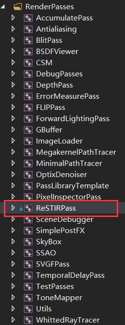
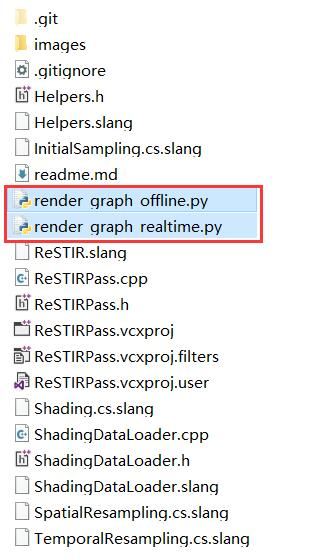

# ReSTIR Pass

a falcor render-pass for ReSTIR Direct Lighting

## How to use

Add this project into the Falcor solution.  
  
After building this pass, you can load the render graph scripts under the project folder via Mogwai.  

## Limitation

> I only used Falcor Light Sampler, including a hierarchical environment map sampler(see EnvMapSampler) and an Alias-Method power-based emissive triangle sampler(see EmissivePowerSampler). If you want to support more light types(such as point light, directional light) or more efficient light sampling techniques, you need to implement corresponding light samplers as initial sampling primitives.

> I used VBuffer instead of GBuffer which may lead to more computation overhead.

> I did not do tricks like Pre-Sampling, Decoupled Shading(see [HPG2021 Rearch ReSTIR](https://research.nvidia.com/publication/2021-07_Rearchitecting-Spatiotemporal-Resampling)). If you want to improve performance further, you need to implement this kind of thing by yourself.

> I only implemented spatial resampling de-bias. You need to implement temporal de-bias by yourself.